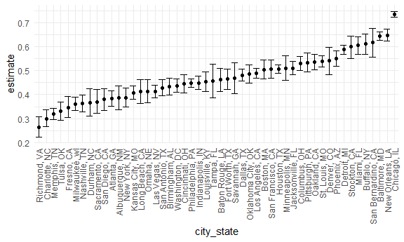
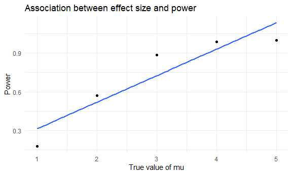

Homework 5
================
Riya Bhilegaonkar
2022-11-06

### Problem 1

The code chunk below imports the data in individual spreadsheets
contained in `./data/problem1/`. To do this, I create a dataframe that
includes the list of all files in that directory and the complete path
to each file. As a next step, I `map` over paths and import data using
the `read_csv` function. Finally, I `unnest` the result of `map`.

``` r
full_df = 
  tibble(
    files = list.files("data/problem1/"),
    path = str_c("data/problem1/", files)
  ) %>% 
  mutate(data = map(path, read_csv)) %>% 
  unnest()
```

    ## Rows: 1 Columns: 8
    ## ── Column specification ────────────────────────────────────────────────────────
    ## Delimiter: ","
    ## dbl (8): week_1, week_2, week_3, week_4, week_5, week_6, week_7, week_8
    ## 
    ## ℹ Use `spec()` to retrieve the full column specification for this data.
    ## ℹ Specify the column types or set `show_col_types = FALSE` to quiet this message.
    ## Rows: 1 Columns: 8
    ## ── Column specification ────────────────────────────────────────────────────────
    ## Delimiter: ","
    ## dbl (8): week_1, week_2, week_3, week_4, week_5, week_6, week_7, week_8
    ## 
    ## ℹ Use `spec()` to retrieve the full column specification for this data.
    ## ℹ Specify the column types or set `show_col_types = FALSE` to quiet this message.
    ## Rows: 1 Columns: 8
    ## ── Column specification ────────────────────────────────────────────────────────
    ## Delimiter: ","
    ## dbl (8): week_1, week_2, week_3, week_4, week_5, week_6, week_7, week_8
    ## 
    ## ℹ Use `spec()` to retrieve the full column specification for this data.
    ## ℹ Specify the column types or set `show_col_types = FALSE` to quiet this message.
    ## Rows: 1 Columns: 8
    ## ── Column specification ────────────────────────────────────────────────────────
    ## Delimiter: ","
    ## dbl (8): week_1, week_2, week_3, week_4, week_5, week_6, week_7, week_8
    ## 
    ## ℹ Use `spec()` to retrieve the full column specification for this data.
    ## ℹ Specify the column types or set `show_col_types = FALSE` to quiet this message.
    ## Rows: 1 Columns: 8
    ## ── Column specification ────────────────────────────────────────────────────────
    ## Delimiter: ","
    ## dbl (8): week_1, week_2, week_3, week_4, week_5, week_6, week_7, week_8
    ## 
    ## ℹ Use `spec()` to retrieve the full column specification for this data.
    ## ℹ Specify the column types or set `show_col_types = FALSE` to quiet this message.
    ## Rows: 1 Columns: 8
    ## ── Column specification ────────────────────────────────────────────────────────
    ## Delimiter: ","
    ## dbl (8): week_1, week_2, week_3, week_4, week_5, week_6, week_7, week_8
    ## 
    ## ℹ Use `spec()` to retrieve the full column specification for this data.
    ## ℹ Specify the column types or set `show_col_types = FALSE` to quiet this message.
    ## Rows: 1 Columns: 8
    ## ── Column specification ────────────────────────────────────────────────────────
    ## Delimiter: ","
    ## dbl (8): week_1, week_2, week_3, week_4, week_5, week_6, week_7, week_8
    ## 
    ## ℹ Use `spec()` to retrieve the full column specification for this data.
    ## ℹ Specify the column types or set `show_col_types = FALSE` to quiet this message.
    ## Rows: 1 Columns: 8
    ## ── Column specification ────────────────────────────────────────────────────────
    ## Delimiter: ","
    ## dbl (8): week_1, week_2, week_3, week_4, week_5, week_6, week_7, week_8
    ## 
    ## ℹ Use `spec()` to retrieve the full column specification for this data.
    ## ℹ Specify the column types or set `show_col_types = FALSE` to quiet this message.
    ## Rows: 1 Columns: 8
    ## ── Column specification ────────────────────────────────────────────────────────
    ## Delimiter: ","
    ## dbl (8): week_1, week_2, week_3, week_4, week_5, week_6, week_7, week_8
    ## 
    ## ℹ Use `spec()` to retrieve the full column specification for this data.
    ## ℹ Specify the column types or set `show_col_types = FALSE` to quiet this message.
    ## Rows: 1 Columns: 8
    ## ── Column specification ────────────────────────────────────────────────────────
    ## Delimiter: ","
    ## dbl (8): week_1, week_2, week_3, week_4, week_5, week_6, week_7, week_8
    ## 
    ## ℹ Use `spec()` to retrieve the full column specification for this data.
    ## ℹ Specify the column types or set `show_col_types = FALSE` to quiet this message.
    ## Rows: 1 Columns: 8
    ## ── Column specification ────────────────────────────────────────────────────────
    ## Delimiter: ","
    ## dbl (8): week_1, week_2, week_3, week_4, week_5, week_6, week_7, week_8
    ## 
    ## ℹ Use `spec()` to retrieve the full column specification for this data.
    ## ℹ Specify the column types or set `show_col_types = FALSE` to quiet this message.
    ## Rows: 1 Columns: 8
    ## ── Column specification ────────────────────────────────────────────────────────
    ## Delimiter: ","
    ## dbl (8): week_1, week_2, week_3, week_4, week_5, week_6, week_7, week_8
    ## 
    ## ℹ Use `spec()` to retrieve the full column specification for this data.
    ## ℹ Specify the column types or set `show_col_types = FALSE` to quiet this message.
    ## Rows: 1 Columns: 8
    ## ── Column specification ────────────────────────────────────────────────────────
    ## Delimiter: ","
    ## dbl (8): week_1, week_2, week_3, week_4, week_5, week_6, week_7, week_8
    ## 
    ## ℹ Use `spec()` to retrieve the full column specification for this data.
    ## ℹ Specify the column types or set `show_col_types = FALSE` to quiet this message.
    ## Rows: 1 Columns: 8
    ## ── Column specification ────────────────────────────────────────────────────────
    ## Delimiter: ","
    ## dbl (8): week_1, week_2, week_3, week_4, week_5, week_6, week_7, week_8
    ## 
    ## ℹ Use `spec()` to retrieve the full column specification for this data.
    ## ℹ Specify the column types or set `show_col_types = FALSE` to quiet this message.
    ## Rows: 1 Columns: 8
    ## ── Column specification ────────────────────────────────────────────────────────
    ## Delimiter: ","
    ## dbl (8): week_1, week_2, week_3, week_4, week_5, week_6, week_7, week_8
    ## 
    ## ℹ Use `spec()` to retrieve the full column specification for this data.
    ## ℹ Specify the column types or set `show_col_types = FALSE` to quiet this message.
    ## Rows: 1 Columns: 8
    ## ── Column specification ────────────────────────────────────────────────────────
    ## Delimiter: ","
    ## dbl (8): week_1, week_2, week_3, week_4, week_5, week_6, week_7, week_8
    ## 
    ## ℹ Use `spec()` to retrieve the full column specification for this data.
    ## ℹ Specify the column types or set `show_col_types = FALSE` to quiet this message.
    ## Rows: 1 Columns: 8
    ## ── Column specification ────────────────────────────────────────────────────────
    ## Delimiter: ","
    ## dbl (8): week_1, week_2, week_3, week_4, week_5, week_6, week_7, week_8
    ## 
    ## ℹ Use `spec()` to retrieve the full column specification for this data.
    ## ℹ Specify the column types or set `show_col_types = FALSE` to quiet this message.
    ## Rows: 1 Columns: 8
    ## ── Column specification ────────────────────────────────────────────────────────
    ## Delimiter: ","
    ## dbl (8): week_1, week_2, week_3, week_4, week_5, week_6, week_7, week_8
    ## 
    ## ℹ Use `spec()` to retrieve the full column specification for this data.
    ## ℹ Specify the column types or set `show_col_types = FALSE` to quiet this message.
    ## Rows: 1 Columns: 8
    ## ── Column specification ────────────────────────────────────────────────────────
    ## Delimiter: ","
    ## dbl (8): week_1, week_2, week_3, week_4, week_5, week_6, week_7, week_8
    ## 
    ## ℹ Use `spec()` to retrieve the full column specification for this data.
    ## ℹ Specify the column types or set `show_col_types = FALSE` to quiet this message.
    ## Rows: 1 Columns: 8
    ## ── Column specification ────────────────────────────────────────────────────────
    ## Delimiter: ","
    ## dbl (8): week_1, week_2, week_3, week_4, week_5, week_6, week_7, week_8
    ## 
    ## ℹ Use `spec()` to retrieve the full column specification for this data.
    ## ℹ Specify the column types or set `show_col_types = FALSE` to quiet this message.

The result of the previous code chunk isn’t tidy – data are wide rather
than long, and some important variables are included as parts of others.
The code chunk below tides the data using string manipulations on the
file, converting from wide to long, and selecting relevant variables.

``` r
tidy_df = 
  full_df %>% 
  mutate(
    files = str_replace(files, ".csv", ""),
    group = str_sub(files, 1, 3)) %>% 
  pivot_longer(
    week_1:week_8,
    names_to = "week",
    values_to = "outcome",
    names_prefix = "week_") %>% 
  mutate(week = as.numeric(week)) %>% 
  select(group, subj = files, week, outcome)
```

Finally, the code chunk below creates a plot showing individual data,
faceted by group.

``` r
tidy_df %>% 
  ggplot(aes(x = week, y = outcome, group = subj, color = group)) + 
  geom_point() + 
  geom_path() + 
  facet_grid(~group)
```


This plot suggests high within-subject correlation – subjects who start
above average end up above average, and those that start below average
end up below average. Subjects in the control group generally don’t
change over time, but those in the experiment group increase their
outcome in a roughly linear way.

### Problem 2

The raw data contains information on more than 52,000 criminal homicides
over the past decade in 50 of the largest American cities. The dataset
contains the columns of `uid`, `reported`, `victim_last`,
`victim_first`, `victim_age`,`victim_sex`, `city`, `state`, `lat`, `lon`
and `disposition`. The data describes the location of the killing,
whether an arrest was made and basic demographic information about each
victim.

``` r
homicide_data = read_csv("data/homicide-data.csv") %>%
  mutate(city_state = str_c(city,    state, sep=", "),unsolved = ifelse((disposition=="Closed without arrest" | disposition =="Open/No arrest"), 1, 0)) %>%
  mutate(city_state = replace(city_state, city_state == "Tulsa, AL", "Tulsa, OK"))
```

    ## Rows: 52179 Columns: 12
    ## ── Column specification ────────────────────────────────────────────────────────
    ## Delimiter: ","
    ## chr (9): uid, victim_last, victim_first, victim_race, victim_age, victim_sex...
    ## dbl (3): reported_date, lat, lon
    ## 
    ## ℹ Use `spec()` to retrieve the full column specification for this data.
    ## ℹ Specify the column types or set `show_col_types = FALSE` to quiet this message.

``` r
city_state = homicide_data %>%
  group_by(city_state) %>%
  summarize("Total" = n(), "Unsolved" = sum(unsolved))
city_state %>%
knitr::kable()
```

| city_state         | Total | Unsolved |
|:-------------------|------:|---------:|
| Albuquerque, NM    |   378 |      146 |
| Atlanta, GA        |   973 |      373 |
| Baltimore, MD      |  2827 |     1825 |
| Baton Rouge, LA    |   424 |      196 |
| Birmingham, AL     |   800 |      347 |
| Boston, MA         |   614 |      310 |
| Buffalo, NY        |   521 |      319 |
| Charlotte, NC      |   687 |      206 |
| Chicago, IL        |  5535 |     4073 |
| Cincinnati, OH     |   694 |      309 |
| Columbus, OH       |  1084 |      575 |
| Dallas, TX         |  1567 |      754 |
| Denver, CO         |   312 |      169 |
| Detroit, MI        |  2519 |     1482 |
| Durham, NC         |   276 |      101 |
| Fort Worth, TX     |   549 |      255 |
| Fresno, CA         |   487 |      169 |
| Houston, TX        |  2942 |     1493 |
| Indianapolis, IN   |  1322 |      594 |
| Jacksonville, FL   |  1168 |      597 |
| Kansas City, MO    |  1190 |      486 |
| Las Vegas, NV      |  1381 |      572 |
| Long Beach, CA     |   378 |      156 |
| Los Angeles, CA    |  2257 |     1106 |
| Louisville, KY     |   576 |      261 |
| Memphis, TN        |  1514 |      483 |
| Miami, FL          |   744 |      450 |
| Milwaukee, wI      |  1115 |      403 |
| Minneapolis, MN    |   366 |      187 |
| Nashville, TN      |   767 |      278 |
| New Orleans, LA    |  1434 |      930 |
| New York, NY       |   627 |      243 |
| Oakland, CA        |   947 |      508 |
| Oklahoma City, OK  |   672 |      326 |
| Omaha, NE          |   409 |      169 |
| Philadelphia, PA   |  3037 |     1360 |
| Phoenix, AZ        |   914 |      504 |
| Pittsburgh, PA     |   631 |      337 |
| Richmond, VA       |   429 |      113 |
| Sacramento, CA     |   376 |      139 |
| San Antonio, TX    |   833 |      357 |
| San Bernardino, CA |   275 |      170 |
| San Diego, CA      |   461 |      175 |
| San Francisco, CA  |   663 |      336 |
| Savannah, GA       |   246 |      115 |
| St. Louis, MO      |  1677 |      905 |
| Stockton, CA       |   444 |      266 |
| Tampa, FL          |   208 |       95 |
| Tulsa, OK          |   584 |      193 |
| Washington, DC     |  1345 |      589 |

While creating the `city_state` variable I noticed that one of the rows
seems to have an incorrect state column value of “AL” - Alabama for the
city of Tulsa, which is actually in Oklahoma. To combat this issue,
after creating the `city_state` variable using str_c() to concatenate
the strings. We additionally create a binary variable of `unsolved` to
determine the number of unsolved homicides which are coded as “Closed
without arrest” and “Open/No arrest”.

To create the table of the number of cities with the total number of
homicides and number of unsolved homicides, we used the grouped by the
`city_state` variable and used the summarize function.

Estimating the proportion of homicides that are unsolved:

``` r
baltimore = homicide_data %>%
  filter(city_state=="Baltimore, MD")

 prop.test(x=sum(baltimore[["unsolved"]]), n=length(baltimore[["disposition"]]), conf.level=0.95) %>% 
  broom::tidy() %>%
   select(estimate, conf.low, conf.high)
```

    ## # A tibble: 1 × 3
    ##   estimate conf.low conf.high
    ##      <dbl>    <dbl>     <dbl>
    ## 1    0.646    0.628     0.663

Hence the estimated proportion is 0.646, the confidence interval for the
proportion for the city of Baltimore, MD is (0.628, 0.663).

Running `prop.test` function to estimate the proportion of homicides,
that are unsolved for each city.

``` r
city_state %>%
  mutate(prop = purrr::map2(Unsolved, Total, ~ prop.test(.x, .y, conf.level=0.95) %>%                   broom::tidy())) %>%
unnest(prop)%>%
select(city_state, estimate, conf.low, conf.high)%>%
knitr::kable()
```

| city_state         |  estimate |  conf.low | conf.high |
|:-------------------|----------:|----------:|----------:|
| Albuquerque, NM    | 0.3862434 | 0.3372604 | 0.4375766 |
| Atlanta, GA        | 0.3833505 | 0.3528119 | 0.4148219 |
| Baltimore, MD      | 0.6455607 | 0.6275625 | 0.6631599 |
| Baton Rouge, LA    | 0.4622642 | 0.4141987 | 0.5110240 |
| Birmingham, AL     | 0.4337500 | 0.3991889 | 0.4689557 |
| Boston, MA         | 0.5048860 | 0.4646219 | 0.5450881 |
| Buffalo, NY        | 0.6122841 | 0.5687990 | 0.6540879 |
| Charlotte, NC      | 0.2998544 | 0.2660820 | 0.3358999 |
| Chicago, IL        | 0.7358627 | 0.7239959 | 0.7473998 |
| Cincinnati, OH     | 0.4452450 | 0.4079606 | 0.4831439 |
| Columbus, OH       | 0.5304428 | 0.5002167 | 0.5604506 |
| Dallas, TX         | 0.4811742 | 0.4561942 | 0.5062475 |
| Denver, CO         | 0.5416667 | 0.4846098 | 0.5976807 |
| Detroit, MI        | 0.5883287 | 0.5687903 | 0.6075953 |
| Durham, NC         | 0.3659420 | 0.3095874 | 0.4260936 |
| Fort Worth, TX     | 0.4644809 | 0.4222542 | 0.5072119 |
| Fresno, CA         | 0.3470226 | 0.3051013 | 0.3913963 |
| Houston, TX        | 0.5074779 | 0.4892447 | 0.5256914 |
| Indianapolis, IN   | 0.4493192 | 0.4223156 | 0.4766207 |
| Jacksonville, FL   | 0.5111301 | 0.4820460 | 0.5401402 |
| Kansas City, MO    | 0.4084034 | 0.3803996 | 0.4370054 |
| Las Vegas, NV      | 0.4141926 | 0.3881284 | 0.4407395 |
| Long Beach, CA     | 0.4126984 | 0.3629026 | 0.4642973 |
| Los Angeles, CA    | 0.4900310 | 0.4692208 | 0.5108754 |
| Louisville, KY     | 0.4531250 | 0.4120609 | 0.4948235 |
| Memphis, TN        | 0.3190225 | 0.2957047 | 0.3432691 |
| Miami, FL          | 0.6048387 | 0.5685783 | 0.6400015 |
| Milwaukee, wI      | 0.3614350 | 0.3333172 | 0.3905194 |
| Minneapolis, MN    | 0.5109290 | 0.4585150 | 0.5631099 |
| Nashville, TN      | 0.3624511 | 0.3285592 | 0.3977401 |
| New Orleans, LA    | 0.6485356 | 0.6231048 | 0.6731615 |
| New York, NY       | 0.3875598 | 0.3494421 | 0.4270755 |
| Oakland, CA        | 0.5364308 | 0.5040588 | 0.5685037 |
| Oklahoma City, OK  | 0.4851190 | 0.4467861 | 0.5236245 |
| Omaha, NE          | 0.4132029 | 0.3653146 | 0.4627477 |
| Philadelphia, PA   | 0.4478103 | 0.4300380 | 0.4657157 |
| Phoenix, AZ        | 0.5514223 | 0.5184825 | 0.5839244 |
| Pittsburgh, PA     | 0.5340729 | 0.4942706 | 0.5734545 |
| Richmond, VA       | 0.2634033 | 0.2228571 | 0.3082658 |
| Sacramento, CA     | 0.3696809 | 0.3211559 | 0.4209131 |
| San Antonio, TX    | 0.4285714 | 0.3947772 | 0.4630331 |
| San Bernardino, CA | 0.6181818 | 0.5576628 | 0.6753422 |
| San Diego, CA      | 0.3796095 | 0.3354259 | 0.4258315 |
| San Francisco, CA  | 0.5067873 | 0.4680516 | 0.5454433 |
| Savannah, GA       | 0.4674797 | 0.4041252 | 0.5318665 |
| St. Louis, MO      | 0.5396541 | 0.5154369 | 0.5636879 |
| Stockton, CA       | 0.5990991 | 0.5517145 | 0.6447418 |
| Tampa, FL          | 0.4567308 | 0.3881009 | 0.5269851 |
| Tulsa, OK          | 0.3304795 | 0.2927201 | 0.3705039 |
| Washington, DC     | 0.4379182 | 0.4112495 | 0.4649455 |

The above table uses prop.test for each city and displays the proportion
of unsolved homicides and the confidence intervals for each.

Creating a plot for the estimates and CI’s for each city, organizing the
cities according to the proportion of unsolved homicides (using
fct_reorder):

``` r
city_state %>%
  mutate(prop = purrr::map2(Unsolved, Total, ~ prop.test(.x, .y, conf.level=0.95) %>%                   broom::tidy())) %>%
unnest(prop)%>%
select(city_state, estimate, conf.low, conf.high)%>%
mutate(city_state = fct_reorder(city_state, estimate))%>%
ggplot(aes(x=city_state, y=estimate))+
  geom_point() +
  theme(axis.text.x = element_text(angle = 90, vjust = 0.5, hjust=1))+
geom_errorbar(aes(ymin=conf.low, ymax=conf.high))
```



From the plot we see that Richmond, VA has the lowest proportion of
unsolved homicides while Chicago has the highest proportion of unsolved
homicides.

## Problem 3

Setting the design elements

``` r
n = 30
sigma = 5
mu = 0
```

Writing a function to generate datasets from the model and conducting a
simulation to explore power in a one-sample t-test:

``` r
onesamp_test = function(n=30, mu, sigma = 5){
  sim_data = tibble(
    x = rnorm(n, mean=mu, sd=sigma)
  )
  
  t_test = t.test(sim_data, conf.level = 0.95) %>%
    broom::tidy()
}
```

Conducting the tests for $\mu=0$

``` r
sim_results_df = 
  expand_grid(
    sample_size = 30,
    mu = 0,
    iter = 1:5000
  ) %>% 
  mutate(
    estimate_df = map2(sample_size,mu, onesamp_test)
  ) %>% 
  unnest(estimate_df)
```

Now repeating the above for $\mu={1,2,3,4,5,6}$:

``` r
sim_results_df2 = 
  expand_grid(
    sample_size = 30,
    mu = c(1,2,3,4,5),
    iter = 1:5000
  ) %>% 
  mutate(
    estimate_df = map2(.x=sample_size,.y=mu, ~onesamp_test(n = .x, mu =.y))
  ) %>% 
  unnest(estimate_df)
```

Making a plot showing the proportion of times the null was rejected on
the y axis and the true value of $\mu$ on the x axis:

``` r
sim_results_df2 %>%
  group_by(mu) %>%
  filter(p.value < 0.05) %>%
  summarize(prop = n()/5000) %>%
  ggplot(aes(x=mu, y=prop))+
  geom_point()+
  geom_smooth(method="lm", se=FALSE)+
  labs(x = "True value of mu",
       y = "Power",
       title= "Association between effect size and power")
```

    ## `geom_smooth()` using formula 'y ~ x'



From the plot we see that there is a positive linear relationship
between the true value of $\mu$ and the power and we see that as the
value of $\mu$ increases the power of the test is close to 1, which
indicates that the hypothesis test is good at detecting a false null
hypothesis. This indicates The effect size measures the strength of the
relationship between variables in a population. As the effect size
increase, the power of the test increases.

Make a plot showing the average $\hat{\mu}$ on the y-axis and the true
value of $\mu$ on the x axis, and overlay the average estimate of
$\hat{\mu}$ only in samples for which the null was rejected:

``` r
sim_results_df2 %>%
  group_by(mu) %>%
  summarize(est_mu = mean(estimate))%>%
  ggplot(aes(x=mu, y=est_mu))+
  geom_point()+
geom_point(data=sim_results_df2%>%filter(p.value < 0.05)%>% group_by(mu) %>% summarize(est_mu = mean(estimate)), color="red")+
  labs(x = "True value of mu",
       y = "Average estimate of mu_hat", main="Estimated Average Mean vs True Mean")
```


The sample average $\hat{\mu}$ value across tests for which the null is
rejected is approximately equal to the true value of $\mu$ for larger
values of $\mu$, which aligns with our reasoning that increases in
effect size cause increases in power of a test. Though we do see that in
the case of smaller $\mu$ values of 1, 2, 3, the estimates for which the
null is rejected are slightly overestimating the value of the true
$\mu$, this is due to the fact that these values have a smaller power
value, and hence a smaller probability of successfully reject the null
hypothesis.
